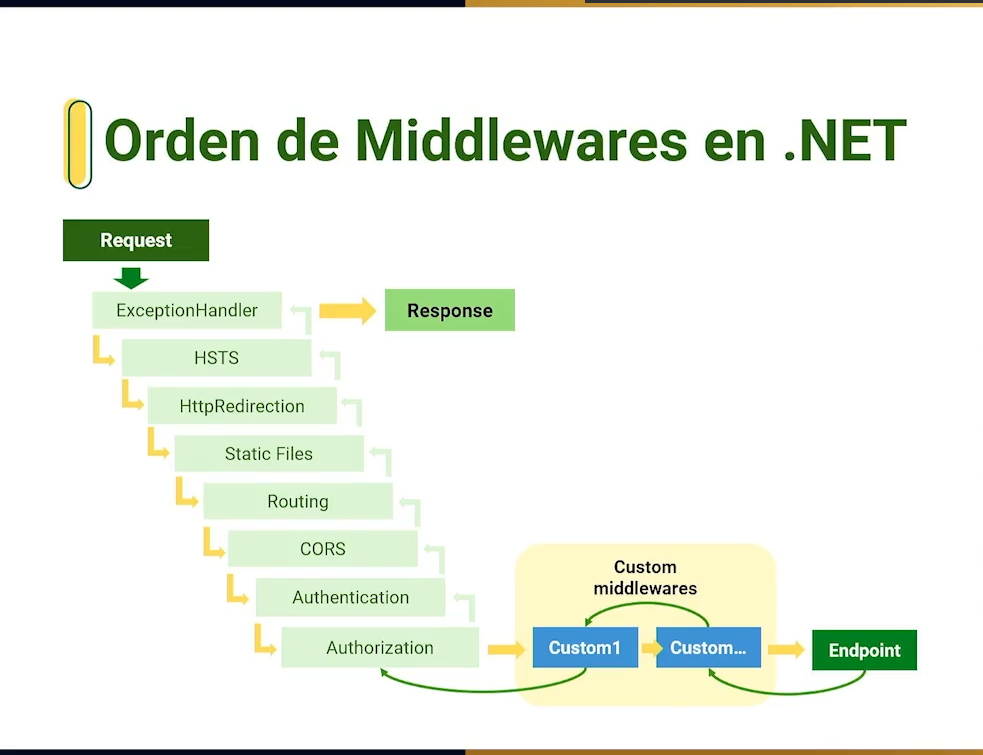

# Curso de APIs con .NET

## Clase 3 - ¿Qué es una API?

Application Programming Interface: Una aplicación que nos permite crear una capa de extracción entre una aplicación y otra.

**Catacteristicas:**

- Exponer método y funciones para ser consumido por otras aplicaciones.
- Posee una capa de abstracción para ser consumida.
- Puede tener capas de seguridad que brinden autenticación y autorización.

## Clase 4 - ¿Qué es REST?

REST es un acrónimo que significa “***Representational State Transfer***”. Es un estilo de arquitectura de software que se utiliza para desarrollar aplicaciones en la web.

REST es una forma estándar de crear `APIs`, y se basa en la utilización de protocolos HTTP (Hypertext Transfer Protocol) para realizar operaciones CRUD (Create, Read, Update, Delete) en recursos web. En otras palabras, REST utiliza los verbos HTTP (como GET, POST, PUT y DELETE) para realizar operaciones en los recursos web.

**Contiene las siguientes propiedades:**

- Rendimiento
- Simplicidad
- Escalabilidad
- Confialidad

**URL:**
Una URL en una API REST debe tener las siguientes propiedades:

1. **Clarity**: La URL debe ser clara y fácil de leer para que sea fácil de entender para los desarrolladores que la utilizan.
2. **Identificación de recursos**: La URL debe identificar de manera clara y concisa el recurso que se está solicitando.
3. **Hierarchía**: La URL debe ser un reflejo de la estructura jerárquica de los recursos, lo que permite una fácil navegación.
4. **Consistencia**: La URL debe ser consistente a lo largo de toda la API y seguir un estándar claro para que sea fácil de seguir.
5. **Accesibilidad**: La URL debe ser accesible para los clientes que utilizan la API, lo que significa que debe ser fácil de recordar y de escribir.
6. **Evitación de duplicados**: La URL debe ser única y evitar la duplicación de recursos para evitar confusiones.
7. **Selección de verbo HTTP adecuado**: La URL debe reflejar el verbo HTTP que se utiliza para la solicitud, por ejemplo, utilizar “GET /recursos” para recuperar una lista de recursos.

**Verbos Http:**
HTTP es un protocolo utilizado para transferir información en la web, y los verbos HTTP son los comandos utilizados para solicitar una acción en un recurso en la web. Los verbos HTTP más comunes son los siguientes:

**`GET`**: utilizado para recuperar información de un recurso. Este es el verbo HTTP más utilizado y es utilizado para recuperar información de una página web o un API.  
**`POST`**: utilizado para enviar información a un recurso para que sea procesada. Por ejemplo, cuando se envía un formulario en una página web, se utiliza el verbo POST para enviar los datos del formulario al servidor.  
**`PUT`**: utilizado para actualizar un recurso existente. Por ejemplo, si desea actualizar la información de un producto en una base de datos, utilizaría el verbo PUT para enviar la nueva información al servidor.  
**`DELETE`**: utilizado para eliminar un recurso. Por ejemplo, si desea eliminar un producto de una base de datos, utilizaría el verbo DELETE para enviar una solicitud al servidor para que lo elimine.  
**`HEAD`**: utilizado para recuperar la cabecera de un recurso sin la respuesta completa.  
**`PATCH`**: utilizado para actualizar parcialmente un recurso existente. Por ejemplo, si desea actualizar solo algunos campos de un producto en una base de datos, utilizaría el verbo PATCH para enviar la información actualizada al servidor.

**Respuestas Http:**
Las respuestas HTTP son mensajes que se envían desde un servidor web a un cliente (como un navegador web o una aplicación) después de haber recibido una solicitud HTTP. Cada respuesta HTTP incluye un código de estado que indica el resultado de la solicitud.

Algunos de los códigos de estado HTTP más comunes son los siguientes:

- **200 OK**: Indica que la solicitud HTTP se ha realizado correctamente y el servidor ha devuelto la información solicitada.
- **201 Created**: Indica que se ha creado un recurso nuevo en el servidor como resultado de la solicitud HTTP.
- **204 No Content**: Indica que la solicitud HTTP se ha procesado correctamente, pero no hay ninguna información que devolver.
- **400 Bad Request**: Indica que la solicitud HTTP no es válida y el servidor no puede procesarla.
- **401 Unauthorized**: Indica que la solicitud requiere autenticación y el cliente no proporcionó credenciales válidas.
- **403 Forbidden**: Indica que el cliente no tiene permisos para acceder al recurso solicitado.
- **404 Not Found**: Indica que el servidor no pudo encontrar el recurso solicitado.
- **500 Internal Server Error**: Indica que ha ocurrido un error en el servidor y no se pudo procesar la solicitud HTTP.

Estos son solo algunos de los códigos de estado HTTP más comunes, pero hay muchos otros. Al trabajar con APIs REST, es importante comprender los códigos de estado HTTP y cómo utilizarlos para determinar el resultado de las solicitudes HTTP y tomar las acciones apropiadas en consecuencia.

## Clase 5 - Creando tu primera API con .NET

Comando en la CLI para mostrar todos los tipos de proyectos que se pueden crear:

```bash
dotnet new --list
```

Comando en la CLI para crear un proyecto webapi:

```bash
dotnet new webapi
```

## Clase 6 - ¿Consumiendo API desde Postman?

Comando en la CLI para ejecutar el proyecto webapi:

```bash
dotnet run
```

Al abrir Postman se utiliza la URL para consumir los datos de demostración que tiene el proyecto:

`http://localhost:5254/WeatherForecast`

## Clase 7 - Análisis del template para APIs de .NET

### Modelo arquitectónico

**MVC:** Sepración de responsabilidades dentro de la estructura del proyecto.

- **Model** = datos
- **View** = interfaz de usuario
- **Controller** = logica

**MXC:** Este es el que se utiliza en el template webapi de .NET

- **Model** = datos
- **Controller** = logica

**Análisis de los archivos:**

- **Controllers:** Este directorio contiene los controladores de la API. Cada controlador es responsable de manejar una o varias solicitudes HTTP y devolver una respuesta.
- **WeatherForecast.cs:** es una clase que contiene las propiedades que se necesitan para alojar o guardar la información.
- **WeatherForecastController.cs:** Es el que se encarga de manejar toda la lógica para poder devolver los datos y exponer las funciones que afecten ese modelo de WeatherForecast.
- **BackendConCSharpYDotNet.csproj:** es el archivo del proyecto, el "TargetFramework" nos dice la versión de framework y el SDK (para las api es el .Web).
- **Program.cs:** es el archivo que contiene toda la configuración del proyecto y la forma de ejecución.
- **appsettings.json:** es el archivo que contiene todas las opciones para configurar el proyecto
- **appsettings.Development.json:** archivo donde normalmente se guardan las conexiones de la base de datos, donde se guardan claves o tokens de servicios en la nube o parametros configurables.
- **launchSettings.json:** es el archivo que contiene la parte de como se ejecuta la API.

## Clase 8 - Atributos para verbos HTTP

Modificación del método GET y creación del método Post y Delete.  
Se realizan pruebas con Postman para verificar el funcionamiento.

## Clase 9 - Manejo de rutas

Les recomiendo usar el comando:

`dotnet watch run`, en lugar de `dotnet run`.
Lo que hace este comando es, compilar de forma automática cada vez que se modifica un archivo y no tener que estar bajando el servicio cada vez que modificamos algo.

En la linea `[Route("[controller]")]` del archivo `WeatherForecastController.cs` lo que nos permite es tener una ruta dinamica con base en el nombre de la clase si hacemos el cambio a `[Route("api/[controller]")]` la ruta de la api cambiaria a `http://localhost:5254/api/WeatherForecast`.

El enrutamiento se puede hacer a nivel de controlador y también se puede realizar un enrutamiento a cada una de las funciones del controlador.

Un mismo método puede tener uno o más rutas de enrutamiento, osea que se puede acceder por diferentes URL al mismo método REST.

El enrutamiento tiene otra palabra dinamica ademas  de `[controller]`, también se puede usar `[Route("[action]")]`, esto nos permite poder utilizar el mismo nombre del método para llamar a la API.

## Clase 10 - Minimal API vs. Web API

**Minimal API:** Se crea para ayudar a entender un poco más fácil a los desarrolladores el como funciona .NET.

- Nueva plantilla con un estilo minimalista.
- Utiliza las últimas mejoras de C# y .Net para disminuir las líneas de código.
- Facilita la curva de aprendizaje de APIs en .NET.

Las peticiones Get, Put, Post o Delete se relizarían directamente en el archivo `Program.cs`, cambiando así en la estructura.

Minimal API, está diseñado para proyectos pequeños que no contenga muchos endPoints y sean proyectos simples.

## Clase 11 - ¿Qué son los middlewares?

- Es una serie de instrucciones de código que se agregan al ciclo de vida de una peticion HTTP.
- Provee una ejecucion de peticiones a través de capas.
- Facilitan la implementacion de interceptores y filtros sobre las peticiones en un API.

Cada vez que se realiza una petición HTTP, lo que pasa es que la petición entra en una línea de diferentes middlewares que van a afectar de alguna manera dicha petición, van a realizar el procesamiento debido para devolver la información que espera el usuario.

Los middlewares hacen el tratamiento desde que inicia el request hasta que devuelve una respuesta.

Los middlewares proveen una ejecución de peticiones atravez de capaz, lo que permite entender la linea de tiempo que va a tener el REQUEST y de esa manera permite saber en donde se requiere crear el middleware o agregarlo para realizar la transformación o el cambio dentro del Request.



Los Custom midddlewares se deben ubicar antes del middleware de Endpoints y después del middleware de autorización. Este orden se debe respetar ya que se pueden generar comportamientos extraños.

En la clase `Program.cs` las lineas de:

```c#
app.UseSwagger();
app.UseSwaggerUI();
app.UseHttpsRedirection();
app.UseAuthorization();
app.MapControllers();
```

Son cada uno son los middlewares que se declaran luego de la linea del build `var app = builder.Build();`.

## Clase 12 - Creando un nuevo middleware

En esta clase se crea un middleware que añade la hora al JSON si en la URL de la petición HTTP se agrega la opción de "?time".

Los middleware nos pueden permitir realizar inicios de sesión, crear bitacora de todos los request en ejecución para guardar la información, interceptar todos los request que han generado error para guardarlos, en alguna archivo o servicio.

## Clase 13 - Inyección de dependencias

La inyección de dependencias es un concepto en programación que se refiere a cómo los componentes de un programa obtienen las dependencias que necesitan para funcionar correctamente. Imagina que estás construyendo una casa con diferentes piezas, como ladrillos, ventanas, puertas, etc.

En términos de programación, los "componentes" son clases o módulos que hacen ciertas tareas. Estos componentes a menudo dependen de otros componentes para funcionar. La inyección de dependencias es como asegurarte de que cada componente obtenga las piezas que necesita para hacer su trabajo en lugar de crear esas piezas dentro del componente mismo.

Imagina que tienes una clase A que necesita utilizar una funcionalidad proporcionada por una clase B. En lugar de crear una instancia de la clase B dentro de la clase A, la inyección de dependencias te anima a crear una instancia de la clase B por separado y luego "inyectarla" en la clase A. Esto se hace a menudo pasando la instancia de B como un parámetro en el constructor de A.

En el contexto de las APIs en .NET, la inyección de dependencias es útil para separar las responsabilidades y facilitar el mantenimiento y la prueba de tu código. En lugar de tener componentes que crean sus propias dependencias internamente, estas dependencias se proporcionan desde fuera, lo que hace que tu código sea más modular y más fácil de reemplazar o cambiar en el futuro.

En resumen, la inyección de dependencias es como dar a tus componentes las piezas que necesitan para funcionar, en lugar de pedirles que creen esas piezas por sí mismos. Esto ayuda a mejorar la organización y flexibilidad de tu código.

- **AddScoped:** crea una instancia por cada request del cliente.
- **AddTransient:** crea una instancia por cada controlador.
- **AddSingelton:** crea una sola instancia para todo lo que dure la ejecución de la API.

[Tipos de Inyección de dependencias en ASP .Net | Transient vs Scoped vs Singleton](https://www.youtube.com/watch?v=srPGwwMwAoA&ab_channel=hdeleon.net)


## Clase 14 -Agregando Logging a API

Al implementar "Logging" nos permite realizar la trazabilidad de lo que esta ocurriendo en las diferentes acciones de la API, nos permite llevar un registro de cada acción, se puede agragar esta trazabilidad en cualquier punto de la API ya sea en el controlador o en una clase especifica.

