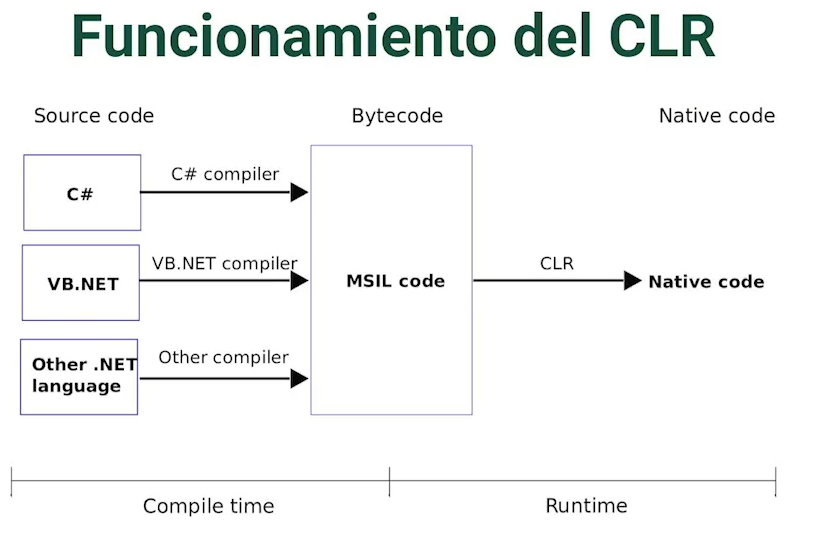
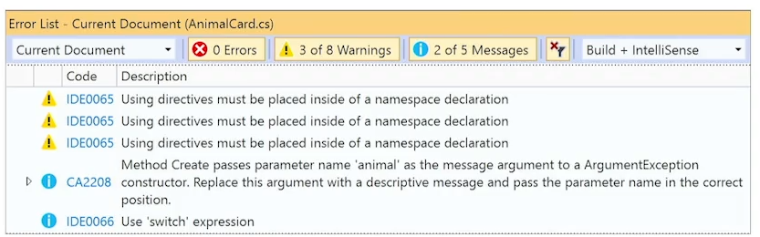
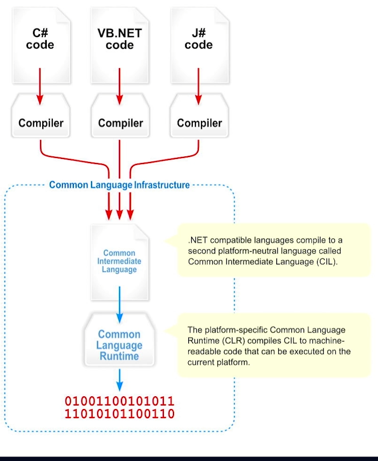
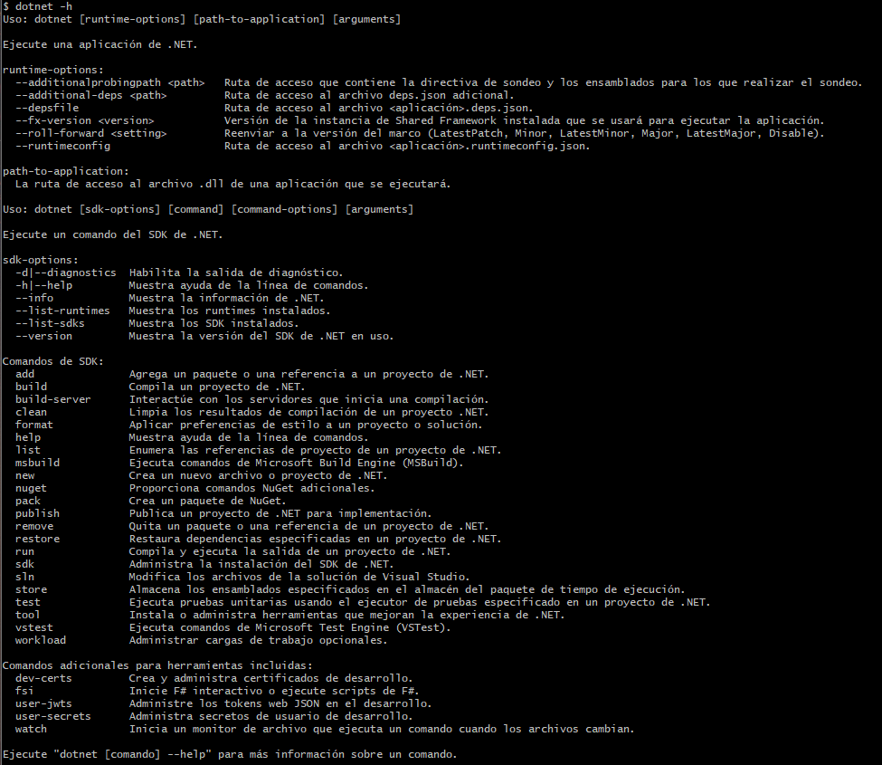

# Curso de Fundamentos de .NET

## Clase 1 - Todo lo que aprenderás sobre .NET

- Conocimientos base de .NET
- Análisis de los componentes para el funcionamientos de .NET
- Demos para el acercamiento a esta tecnólogia.

## Clase 2 - Prerrequisitos

- Conceptos generales de programación.
- Conocimientos generales de C#.
- Visual Studio Code.

## Clase 3 - ¿Qué es .NET?

Plataforma de desarrollo de aplicaciones creada por Microsoft.

Cuando se habla de .NET es un conjunto de librerias que permiten desarrollar aplicaciones para diferentes plataformas.

.NET fue creada por Microsoft para ofrecerle a los desarrolladores la oportunidad de crear fácilmente aplicaciones de todo tipo utilizando un solo SDK (kit de desarrollo de software), unico conjunto de librerias base para todas las posibles plataformas y tipos de posibles aplicaciones que hay en el mercado.

**Datos sobre .NET**:

- Creada en 2016.
- De código abierto y gratuito.
- Multiplataforma.
- Programado en y C++.
- Orientado a alto rendimiento y la nube.

___
Enlaces:

[.NET documentation | Microsoft Docs](https://docs.microsoft.com/dotnet/)
[GitHub - dotnet/core: Home repository for .NET Core](https://github.com/dotnet/core)

## Clase 4 - .NET Framework vs .NET Core

.NET Framework fue la primera versión que se liberó de .NET y .NET Core es la versión moderna, es la evolución como tal de este Framework.

**.NET Framework**:

- Primera versión del framework en 2001.
- Compatible solo Windows.
- Plataforma de ejecución intermedia.
- Compatible con VB .NET, F#, Visual C++.
- Diseñado para apps corporativas con arquitectura tradicional.
- Soporte extendido por al menos 10 años.

**Tabla de diferencias**:

|.NET Framework | .NET Core |
|---------------|-----------|
|Compatible con Windows.|Multiplataforma (Windows,Linux, MacOS).|
|C#, Visual Basic .NET, F#, Visual C++.|C#, F#, Visual Basic.|
|Orientado a aplicaciones monolíticas y corporativas.|Orientado al alto rendimiento y arquitecturas orientadas a la nube.|
|Dependencia de Visual Studio.|Sin dependencias de IDE o editor de texto.|

**.NET Core = .NET**:

Microsoft quiere evitar el uso del nombre como tal de **.NET Core**, sino que en su estandar, documentación entre otros, el objetivo es que se mencione solamente como **.NET**

**En resumen**:

- **.NET**:
  - Es la abreviatura de .NET Core, versión actual de .NET.

- **.NET Core**:
  - Es la evolución .NET y sucesor de .NET Framework.

- **.NET Framework**:
  - Primera versión del framework con soporte extendido.

## Clase 5 - Ventajas y usos de .NET

**Podemos usar .NET para crear:**

- Aplicaciones de consola y librerías.
- Aplicaciones para Windows usando WinForms, WPF, UWP, WinUI 3.
- Aplicaciones web y web APIs usando ASP .NET.
- Aplicaciones móviles usando Xamarin y NET MAUI.
- Aplicaciones Web usando Web assembly con Blazor.

**Ventajas:**

- Multiplataforma.
- Compatible con múltiples lenguajes de programación.
- Muchas herramientas y librerías gratuitas.
- Evolución y mejoras.
- Apoyo de la comunidad y documentación.
- Soporte continuo.
- Integración con servicios Microsoft.
- Retrocompatibilidad.

## Clase 6 - Línea de tiempo de .NET y C\#

- **Primera línea de tiempo**:

  - 2002 - **.Net Framework 1.0**
  - 2005 - **.Net Framework 2.0**
  - 2010 - **.Net Framework 4.0**
  - 2012 - **.Net Framework 4.5**
  - 2016 - **.Net Framework 4.6.1** - **.NET Core 1.0**

- **Línea de tiempo .NET**:
  - 2016 - **.NET Core 1.0**
  - 2017 - **.NET Core 2.0 (LTS)**
  - 2019 - **.NET Core 3.0 (LTS)**
  - 2020 - **.NET Core 5**
  - 2021 - **.NET 6 (LTS)**
  - 2022 - **.NET 7**
  - 2023 - **.NET 8 (LTS)**
  - 2024 - **.NET 9**

## Clase 7 - Common Language Runtime (CLR)

Es la base con la que se ejecutan las aplicaciones de .NET, ya sea en la máquina local o aplicaciones en producción.

**Características**:

- Transforma de Common Intermediate Language (CIL) o MSIL a Código nativo.
- Compilador en tiempo de ejecución.
- Agiliza la ejecución del código compilado.

Todos los lenguajes que trabajan con .NET son lenguajes compilados, así que son lenguajes que pasan de una sintaxis de alto nivel a una sintaxis de bajos nivel. Luego de que se realiza está transformación, entra un componente a ejecutar ese lenguaje de bajo nivel en este caso el **CLR**.

El CLR se utiliza en tiempo de ejecución, mientras se este programando o compilando el CLR no hace nada.

EL CLR ayuda a agilizar la ejecuión del código compilado, esto permite que .NET sea una plataforma rápida con gran rendimiento.



**CoreCLR para .NET Core**:

Es una nueva versión del CLR que se creó con .NET Core.

## Clase 8 - Compilador Roslyn

Los lenguajes deben de pasar por un proceso de transformación y debe de haber un agente que se encargue de hacer dicha transformación en ese caso el compilador Roslyn.

- Conocido como .NET Compiler Platform.
- Soporta C# y Visual Basic.
- Analiza estilo y calidad de código usando niveles de severidad.
- Rápido y ágil.

Fue desarrollado junto con la nueva versión de .NET para agilizar el proceso de compilación, es decir el proceso de transformación que tienen los lenguajes de programación de alto nivel a un lenguaje de bajo nivel que pueda ser ejecutado por el CLR.

Roslyn soporta 2 lenguajes de programación que son C# y Visual Basic, ambos lenguajes son análizados y convertido a este lenguaje de bajo nivel por el mismo compilador.

Roslyn permite análizar el estilo y la calidad de código. Ha venido mejorando para mejorar la expeiencia de desarrollo con .NET

Ejemplo:
Roslyn genera las advertencia de las directiva que se están utilizando y muestra sugerencias del código que acaba de analizar.



Roslyn viene integrado por defecto en Visual Studio y al dotnet CLI.

## Clase 9 - Common Language Specification

Es una regla de metricas que deben seguir los lenguajes para que puedan ser compilados todos a un mismo lenguaje de bajo nivel para luego ser ejecutados y leídos por .NET.

> Permite compilar los lenguajes de alto nivel en un lenguaje común Common Intermediate Language (CIL)

El CLS es una serie de reglas que deben seguir todos los lenguajes para poder ser compilados a un único lenguaje que sería el Common Intermediate Language (CIL), en caso de .NET el **CLS** traduce a un código conocido como "Assembly" y este código es el mismo para cualquer lenguaje de programación (C#, F#, Visual Basic).

**Características**:

- Diseñado para lenguajes compilados.
- Soporta C#, Visual Basic, F#.
- Permite comunicación entre componentes de diferentes de lenguaje.

**Ejemplo de CLS:**



## Clase 10 - Common Type System

Define los diferentes grupos de tipos de datos que debe tener un lenguaje de programación que sea compatible con .NET.

**Características**:

- Define los tipos generales que se usan dentro del lenguaje.
- Provee la librería base para los tipos primitivos (byte, char, int).
- Provee un modelo de tipos orientado a objetos.

**Categorias del CTS**:

- Clases
- Estructuras
- Enumeraciones
- Interfaces
- Delegados

## Clase 11 - Instalación del SDK

[Download .NET (Linux, macOS, and Windows)](https://dotnet.microsoft.com/en-us/download)

Comando para verificar la versión instalada:

```Bash
dotnet --version
```

## Clase 12 - IDEs para trabajar con .NET

IDE: Integrated Development Environment, entorno de desarrollo integrado.

- **Visual Studio**: es la herramientas más completa para trabajar con .NET.

  - **Características de VS**: **

    - Integrado a .NET Framework y .NET Core.
    - Soporta todos los tipos de proyectos de .NET.
    - Soporta extensiones para ampliar funciones.
    - Nueva versión cada 3 años.
    - Plataforma Windows.
    - Version Community, Profesional, Enterprise.

- **Rider de JetBrains**:
  - **Características de Rider**
    - Más ligero que Visual Studio.
    - Herramientas avanzadas de autocompletado.
    - Multiplataforma.
    - Contiene las herramientas de Resharper.
    - Licenciado.

- **Visual Studio Code**
  - **Características de VS Code**
    - Multiplataforma.
    - Ligero.
    - Muchas extensiones para potencializar.
    - Gratuito y de código abierto.
    - Soporte la mayoría de lenguajes de
    - programación.

## Clase 13 - dotnet CLI

**Command-line interface**: Es una de las herramientas más importantes que tiene .NET. Con esta herramientas se podrá compilar, ejecutar y publicar los proyectos desarrollados en .NET.

Se divide en 2 grupos de comandos:

**Generales**:

- Creación de un proyecto.
- Creación de archivos de configuración.
- Invocación de tools.

**Sobre un proyecto**:

- Restaurar.
- Compilar.
- Ejecutar.
- Limpiar.
- Ejecutar pruebas.

`dotnet --help`: Comando que brinda toda la ayuda de como funciona el CLI, lista los comando y tiene una breve descripción de para que funciona cada uno.


`dotnet --version`: Revisar la versión de .NET que está instalada.

`dotnet --info`: permite revisar las diferentes versiones de los SKD de .NET que se tienen instalada en el equipo.

`dotnet new`: nos va a dar las opciones que se tiene para crear un nuevo proyecto en .NET.

## Clase 14 - Primera App con dotnet CLI

`dotnet new console`: Para crear un proyecto con la plantilla de tipo consola, se crea un proyecto de consola.

`dotnet new list`: Muestra los nombre de todas las plantillas disponibles para crear un nuevo proyecto en .NET.

`dotnet run`: comando para ejecutar el proyecto luego de haber sido creado.
