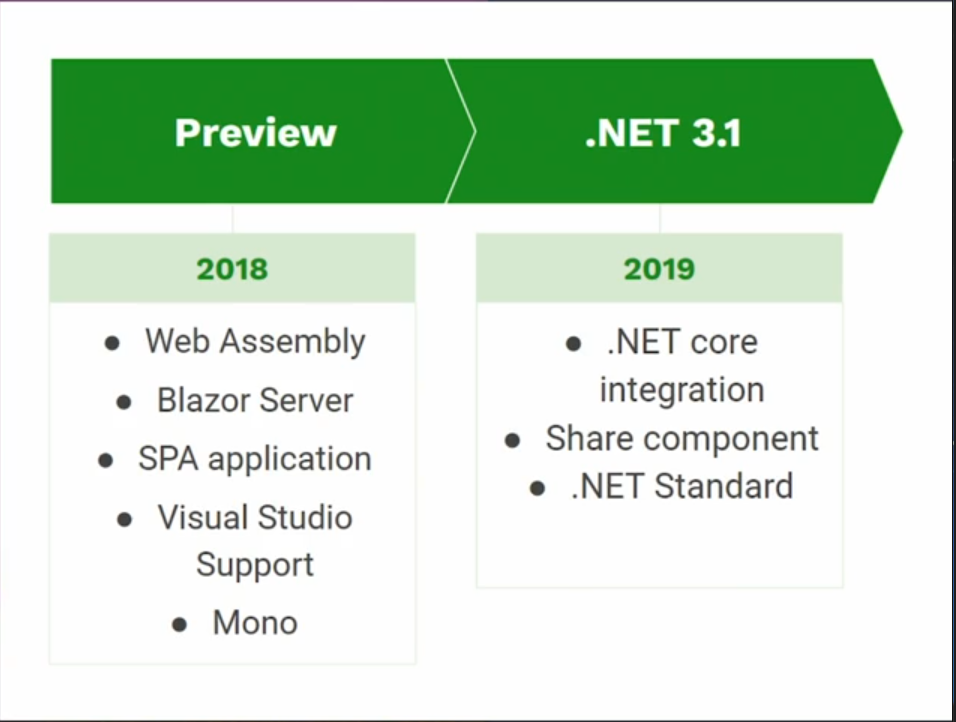
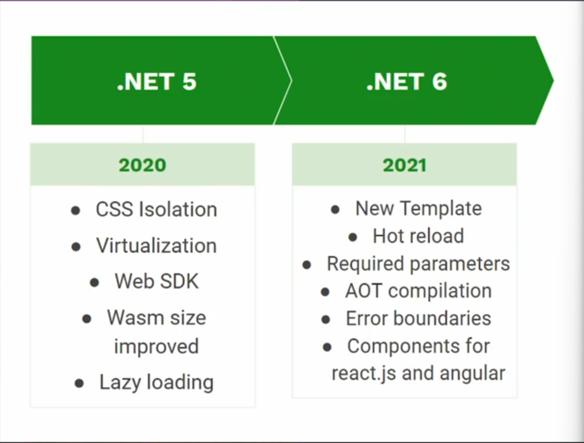
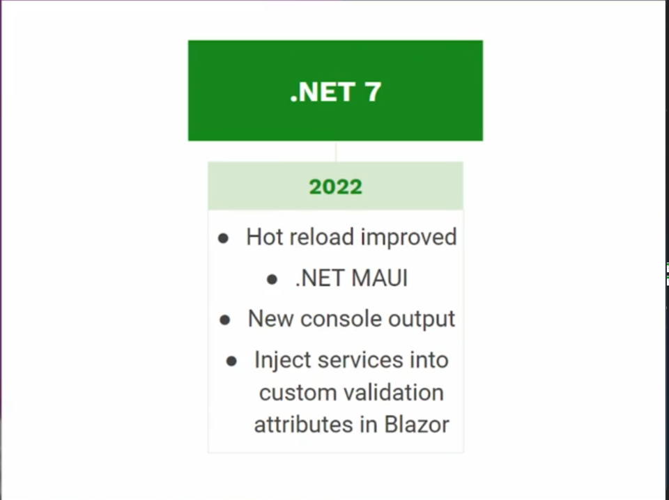
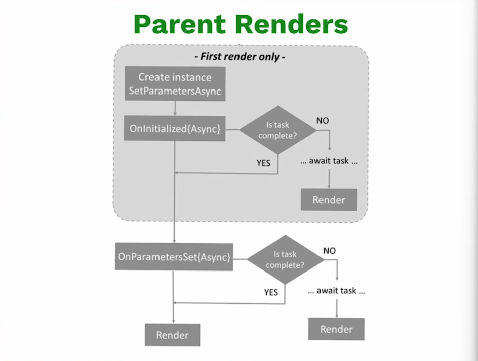

# Curso de Aplicaciones Web con Blazor WebAssembly y .NET

Potencia tu carrera como programador .NET FullStack con .NET. y Blazor. Aprende sobre WebAssembly y como se aplica en Blazor para crear aplicaciones con C# y HTML sin depender de JavaScript. Analiza la arquitectura, estructura y diferentes funcionalidades que puedas agregar a tus proyectos.

## Clase 1 - Presentación

Se revisaran conceptos de:

- Blazor.
- WebAssembly.
- Diferencias estre Blazor Server y Blazor WebAssembly.
- Arquitectura y estructura de los componentes en Blazor y las diferentes funcionalidades.

## Clase 2 - Prerrequisitos

- Conocimiento en C# y .NET
- Visual Code o Visual Studio
- Conocimientos sobre desarrollo web (HTML, CSS, JavaScript)
- .NET 6 0 superior.

## Clase 3 - ¿Qué es WebAssembly y Blazor?

**WebAssembly:**

- Nuevo estándar web que aparece por primera vez en 2015.
- Diseñado inicialmente para C/C++.
- Permite a lenguajes compilados ejecutarse en el navegador (Rust, C++, Go, C#).
- Extensiones .wast, .wasm
- Puede trabajar junto con JavaScript.

Es muy bueno trabajando con grandes cantidade de datos y procesando gran información, Javascript es muy buenos interactuando con el CSS y con el navegador.

**Caso de éxito con WebAssembly**:

- Figma
- AMPED Studio
- Google earth

**Blazor**:

- Nueva tecnología para el desarrollo web. (Cambia un poco el paradigma que se tenia con ASP.NET)
- Basado en componentes.
- Sintaxis C# + HTML.
- Open source y multiplataforma.
- Muchas librerías y apoyo de la comunidad.
- Puede trabajar junto con JavaScript.

**Blazor WebAssembly VS Blazor Server:**

|||
|--------------------------|-------------------------|
|Se ejecuta en el navegador|Se ejecuta en el servidor|
|Utiliza Web Assembly para hospedaje en el navegador|Utiliza SignalR para sincronizar los cambios.|
|Mejor experiencia en la web|Excelente para manipular grandes cantidades de datos y lógica de negocio|
|Soporta progressive web apps (PWA)|

**Evolución de blazor en el tiempo**:





Enlaces:
[Made with WebAssembly](https://madewithwebassembly.com/)

Lecturas recomendadas:

- [Made with WebAssembly](https://madewithwebassembly.com/)
- [ASP.NET Core Blazor | Microsoft Learn](https://docs.microsoft.com/en-us/aspnet/core/blazor)

## Clase 4 - Creando un proyecto de Blazor en Visual Studio

Revisar en Visual Studio que se tenga instalada la carga de trabajo de `ASP.NET and web development` en la opcion de `Herramientas -> Obtener herramientas y características...`

Luego en las plantillas de un nuevo proyecto en Visual Studio se selecciona la opción de `Aplicación Blazor para WebAssembly` (Blazor WebAssembly App) una vez asignado el nombre del proyecto y la ruta donde quedará almacenado.

En la información adicional se usa:

- Framework: .NET 6.0
- Authentication de campo: Ninguno
- Configurar para HTTPS.
- Aplicación web progresiva

Ya con esto se puede crear el proyecto.

Al ejecutar el proyecto este abre una página web de demo que genera el proyecto y que será la base para comenzar a trabajar.

La funcionalidad de recarga activa permite que la aplicación cargue y actualice los cambios cada vez que se van guardando los archivos.

## Clase 5 - Creando un proyecto de Blazor con el CLI

Por el CLI una vez ubicado en la carpeta donde se quiere crear el proyecto se utiliza el comando el proyecto

```Bash
dotnet new blazorwasm
```

Comando para compilar:

```Bash
dotnet build
```

Comando para ejecutar el proyecto:

```Bash
dotnet run
```

Comando para tener la recarga activa:

```Bash
dotnet watch
```

## Clase 6 - Analizando extensiones de Visual code para blazor

- C#
- Blazor Snippet Pack
- Blazor Snippets

## Clase 7 - Estructura de componentes y arquitectura en Blazor

- `Program.cs`: Estructura general para poder ejecutar el proyecto, en este archivo se realizará la configuración de los servicios o dependencias que se van a inyectar en la aplicación.

- `cursoDeAplicacionesWebConBlazorWebAssemblyYDotNET.csproj`: archivo de proyecto donde está el SDK de Blazor Web Assembly, verisón de .Net, paquetes de WebAseembly que se utilizan para la ejecución del proyecto.

- `App.razor`: archivo base que va a contener toda la aplica y toda la estructura de componentes que se van a estar creaciondo, normalmente este archivo no se modifica, lo que se hace es extenderlo y agregarle nuevas configuraciones y propiedades.

- `_Imports.razor`: contiene las declaraciones de `using` que se van a utilizar en los componentes de la aplicación, con esto no se tendría que ir a cada componente y colocar el `using` correspondiente.

- Carpeta `wwwroot`: donde se guardan los archivos estaticos, CSS, archivos HTML, imagenes, iconos y demás.

  - Hay un solo archivo `index.html` ya que Blazor es una `SPA` (Single Page Aplication), en donde un unico archivo `HTML` contiene toda la aplicación y lo que hace este archivo HTML es que su interfaz va mutando de acuerdo a lo que el usuario va seleccionando y de acuerdo a los eventos que van ocurriendo, pero siempre es el mismo archivo HTML.

- Carpeta `Shared`: Contiene los componente compartidos. Son componente que se van a utilizar en otros componentes dentro del sistema, componentes genericos que se quieren reutilizar dentro del sistema en diferentes partes.

- Carptea `Properties`: Contiene la configuración para que se ejecute la aplicación.

- Carpeta `Pages`: Contiene los componentes de la aplicación.

  - Lo más importante de un componentes es su estructura general:
    - El `@page` que contendrá la ruta por la cual se podrá acceder a dicho componente.
    - El `PageTitle` que se refiere al titulo que lleva la página al momento de navegar a ella.
    - `Estructura del HTML` combinado con CSS y C#, cada vez que se vaya a escribir código C# se va inicializar con el `@` para poder empezar a escribir y para que al momento de que se compile la aplicación sepa que esa porción de código se refiere a C#.
    - La sección de `@code` está reservada para todo el código C# que va a tener el componente.
    - En la parte de arriba siempre tener la estructura HTML y en la parte inferior el código de C#.
    - El ejemplo del evento se hace con `@onclick="nombreDelMetodo"`.
    - También dentro de un componente se puede invocar a otro componente compartido pasandole parametros y atributos según lo configurado por ejemplo en el `index.razor` está `<SurveyPrompt Title="How is Blazor working for you?" />`.

## Clase 8 - Ciclo de vida en componentes y parámetros

Es importante conocer los eventos que ocurren dentro del ciclo de vida de un componente de cualquier aplicación, con este conocimiento se puede entender un poco más como funcionan internanmente estos componente y también se sabrá donde colocar las porciones de código que se requieren agregar para poder cumplir con una necesidad o requierimientos especificos.

> Ciclo de vida se refiere a los **eventos que ocurren desde que se crea un componente hasta que se renderiza**

Esta es la gráfica que se tiene de la documentación oficial de Blazor, donde se puede visualizar el diagrama de flujo que contiene los diferentes eventos que hace parte del ciclo de vida de los componentes de Blazor.



- `SetParametersAsync`: Si quisieramos capturar los párametros que vienen dentro del componentes.
- `OnInitialized{Async}`: Si quisieramos inicializar algunos datos dentro del componente se debe utilizar este evento.
- `OnParametersSet{Async}`

**Lista de eventos**:

- SetParametersAsync
- Onlnitialized{Async}
- OnAfterRenderAsync (manejo de notificaciones, uso de login)
- OnParametersSet{Async}
- StateHasChanged (ocurre cuando cambia algo dentro del estado del componente y la interfaz se va a actualizar)

A nivel de código se sobreescriben los eventos del ciclo de vida para generar un mensaje en la consola del navegador e identificarlos en que momento se ejecuta cada uno.

Adicionalmente al componente de Counter se le agrega un parametro para inicializar el valor del contador según el dato que se ingrese en la URL que se configuró como parametro:

`https://localhost:7135/counter/15`

Otra forma de pasar un parametro es por medio del QueryString, se crea la variable con el atributo de `[SupplyParameterFromQuery]` que permitirá usar QueryString:

`https://localhost:7135/counter?CounterFromQuery=10`

Enlaces:

[ASP.NET Core Razor component lifecycle | Microsoft Learn](https://docs.microsoft.com/en-us/aspnet/core/blazor/components/lifecycle)

## Clase 9 - Creando componentes compartidos

Todo lo que se encuentre dentro de la carpeta `Shared` son componente compartidos, componentes que se utilizan en todos los demás componentes del sistema.

A nivel de código se crea un nuevo componente compartido para manejar el titulo en los otros componentes.

Los componentes compartidos dentro de Blazor, son componentes que no son llamado directamente en la aplicación, sino que son piezas de código que se reutilizan dentro de otros componentes, con estás piezas se puede tener un patrón similar, de esata manera se reutiliza código y permite hacer cambios de manera rápida.

## Clase 10 - Creando archivo de configuración

Al muy común que siempre se debe incluir dentro de una aplicación es la posibilidad de realizar alguna configuración sin necesidad de cambiar directamente el código.

Dentro de .NET existe un archivo llamado `appsenttings.json` este archivo también se utiliza en aplicaciones Blazor para lograr este proposito, sin embargo no viene por defecto.

Dentro de la carpeta `wwwroot` se crea el archivo `appsenttings.json`.

A nivel de código se crea un atributo en el archivo `appsenttings.json` para utilizar el atributo y su valor asignado desde el archivo `index.razor`. Para poder hacer uso del archivo `appsenttings.json` existe una interfaz que se encarga de realizar dicha conexión y se encuentra dentro de los servicios de Blazor, lo que se debe de hacer es recibirla como inyección de dependencias.

Con la linea `@inject IConfiguration config` se recibe toda la configuración del archivo `appsenttings.json`.

**Comentario:**
En la pagina de microsoft hay varios ejemplos de que mas podemos hacer con los archivos de configuracion
[ASP.NET Core Blazor configuration](https://learn.microsoft.com/en-us/aspnet/core/blazor/fundamentals/configuration?view=aspnetcore-7.0)

## Clase 11 - Configurando conexión al backend para el proyecto

Proyecto base donde se listaran productos, con posibilidad de eliminar cualquier producto con su respectiva opción, además se contará con una opción para agregar un nuevo producto y luego se visualizará.

Se usará la API de platzi: [Platzi Fake Store API](https://fakeapi.platzi.com)

En el archivo `appsenttings.json` se configura la url de la API para poderla usar en el proyecto.

En el archivo `program.cs` se termina de configurar el uso de la API, ya que se le debe indicar al proyecto que esa va a ser la API a la que se va a conectar.

Si quisieramos hacer conexión a multiples API's o multiples servicios, se puede hacer utilizando el `HttpFactory` que nos ayuda a construir diferentes `HttpClient`. También se puede crear el propio `HttpClient` en donde se este trabajando en el componente que se este trabajando y no usar el HttpClient generico que se inyecta de manera automatica.

## Clase 12 - Creando componentes para conexión a la API

Se crea la carpeta `Models` para generar las clases con los modelos de `Product` y `Category`.

Luego se crea la carpeta para generar los servicios que utilizan los modelos anteriormentes creados, y que se comunican con la API para poder consultar la información, agregarla y eliminarla.

**Enlaces:**
[Products - Platzi Fake Store API](https://fakeapi.platzi.com/doc/products)

[Clases a partir de un objeto json](https://quicktype.io/csharp)

## Clase 13 - Mostrando lista de productos

Se va a terminar la configuración de los servicios que se van a conectar a la API y se va a crear un componente para listar los productos.

Lo que queda faltando dentro de los servicios básicamentes es crear las interfaces, los tipos abstractos que se van a inyectar a los componente que lo vayan a utilizar, luego de realizar esa configuración los servicios van a quedar habilitados para cualquier componente en Blazor.

Principalmente se va a utilizar en el componente de `Product` donde se van a estar listando los productos y van a estar todas las funcionalidades.

Se crea la interfaz y se realiza la implementación de la interfaz en la clase para poder crear esa relación entre la clase y la interfaz. Ya luego que se utilice la interfaz y se haga la configuración de la inyección ya sabemos la implementación que esa interfaz tiene.

En la carpeta `Pages` se crea el componente para la intefaz gráfica.

## Clase 14 - Creando Menú y CSS para la lista de productos

Blazor tiene una opción que se llama **"CSS isolation"** que permite asociar un archivo CSS para cada componente, para esto es necesario que el nombre del archivo sea exactamente igual al del componente terminado con CSS, para este caso sería **"Products.razor.css"**.

## Clase 15 - Creando formulario para agregar registros

Crear formulario para agregar productos.

Se crea la estructura base para poder terminar la funcionalidad de agregar, se crea la navergación entre agregar producto y productos.

En la siguiente clase se crerá la implementación para que agregar producto pueda conectarse a la API y guardar los datos.

## Clase 16 - Integrando formulario con servicios

A nivel de código se complementa la información del formulario para agregar un nuevo producto.

## Clase 17 - Creando funcionalidad de eliminar usando JavaScript

Se inyecta la interfaz para poder usar Javascript `@inject IJSRuntime JSRuntime`.

A nivel de código habia un error con la forma en la que se asignaba la lista de productos para que este se pudiera refrescar dentro de la interfaz para ver el cambio al eliminar un producto.

## Clase 18 - Usando Librerías de Blazor
