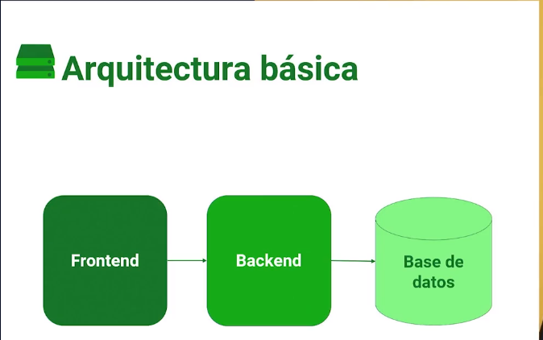
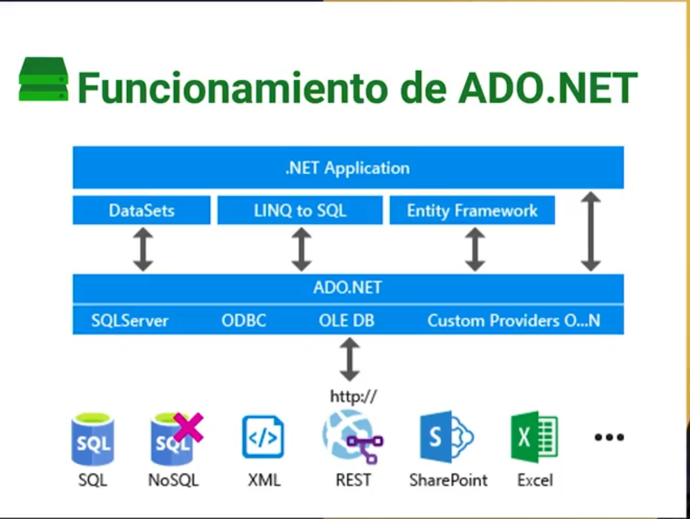
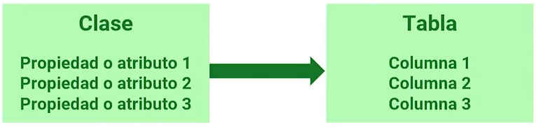
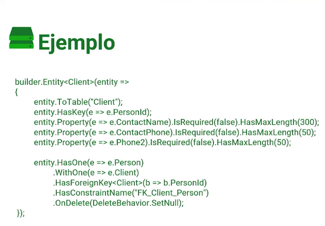

# Curso de Fundamentos de Entity Framework

Descubre Entity Framework, un ORM moderno diseñado para .Net con un proyecto para sumar a tu portafolio. Realiza la conexión a una base de datos y crea los modelos utilizando Fluent API.

- Crea un proyecto .NET con Entity Framework.
- Utiliza Fluent API para especificar la configuración de los modelos.
- Conoce qué son las migraciones y agrega datos semilla al proyecto.
- Aprende los elementos de un CRUD para consumir datos con - Entity Framework

## Clase 1 - Bienvenida y presentación

Se aprenderá desde cero como funciona este componente de .NET, que permite conectarnos a una base de datos.

- Se analizarán los conceptos que maneja Entity Framework para su funcionamiento.

- Se revisarán 2 formas en las que se pueden utilizar Entity Framework, ya sea con atributos o Fluent API.

Se crearán 2 módelos: 1 de categoria y 1 de tareas, ambos están relacionados para poder análizar como Entity Framework crea las relaciones entre diferentes tablas

Luego esta configuración se conectará a una base de datos real y por ultimo se aprenderá como realizar las diferentes acciones de crea, actualizar y eliminar utilizando Entity Framework.

## Clase 2 - Prerrequisitos

- Conocimientos y experiencia en C#.
- Conocimientos de bases de datos.
- SDK de .NET.
- Visual Studio Code.
- Postman.
- SQL server / PostgreSQL.
- SQL management.

## Clase 3 - Conexión a base de datos

**Arquitectura básica**:



Entity Framework se encarga de simplificar como construimos el Backend para podernos conectar a la base de datos.

**Tipos de conexión**:

- ODBC
- OLEDB
- SQL server
- Conexión Azure SQL

ODBC y OLEBD son drivers que se instalan directamente en el computador y por medio de una cadena se conexión se establece la conexión con la base de datos.

SQL server y Azure SQL son conexiones de Microsoft para la conexión.

En .NET tenemos un componente que permite hacer todas las conexiones a la base se datos, este componente se llama "**ADO.NET**" es un conjunto de librerías para acceder a bases de datos y servicios de datos.

**Funcionamiento de ADO.NET**:



## Clase 4 - ¿Qué es un ORM en programación?

 _**Object**-Relational Mapping_: Es una herramienta que realiza un mapeo que nos permite transformar los objetos de la base de datos como tablas y esquemas a clases con atributos en código de programación para poder manipular la información de una forma más fácil sin requerir de SQL.

Se apoya en objetos y clases para realizar la representación del concepto a utilizar.

**Desafíos en la conexión a una base de datos**:

- Mantenimiento del esquema.
- Creación de consultas usando SQL.
- Transformación de datos para ser usados en el backend.
- Garantizar la seguridad al manipular datos.

**ORM**:

Modelado de bases de datos relacional usando programación orientada a objetos.

Reemplaza a SQL como lenguaje de consultas utilizando funcionaes.



**ORM populares**:

- Hibernate (Java)
- Dapper (.NET)
- NHibernate (.NET)
- Django ORM (Python)

## Clase 5 - Introducción a Entity Framework

- ORM de código abierto para .NET.
- Utiliza ADO.NET para facilitar la conexión a bases de datos y la manipulación de datos.

EF es compatible con: SQL Server, Azure SQL
Database, SQLite, Azure Cosmos DB, MySQL,
PostgreSQL, y otras bases de datos utilizando un API
plugin.

Entity Framework VS Entity Framework Core

Así como a ido evolucionando .NET también a ido evolucionando el Entity Framework.

**Ventajas  de EF:**

- Mejora la velocidad de desarrollo.
- Permite manejar un solo repositorio para backend y base de datos.
- Mejora la seguridad.
- Permite programar de manera más amigable y fácil.
- Nos permite controlar el historial de cambios de la base de datos de manera muy sencilla.

## Clase 6 - Creación de proyecto .NET con Entity Framework

**Proyecto .NET usando Minimal API**:

**Modelo - Tarea**:

- TareaId
- CategoriaId
- Titulo
- Descripcion
- Prioridad
- Fecha_Creacion

**Modelo - Categoria**:

- CategoriaId
- Nombre
- Descripcion

El proyecto se crea con el comando `dotnet new web`, luego es necesario realizar la instalación del paquete de `Microsoft.EntityFrameworkCore` que se encuentra en [nuget.org](https://www.nuget.org/), se utilizará el comando del .NET CLIENT

```Bash
dotnet add package Microsoft.EntityFrameworkCore --version 7.0.4
```

Se debe buscar la versión acordé con el SDK que se esté trabajando en el proyecto y que no sea una version "preview".

El paquete `Microsoft.EntityFrameworkCore.InMemory` ayudará a crear una base de datos en memoria y poder probar el modelo que se está creando en .NET.

```Bash
dotnet add package Microsoft.EntityFrameworkCore.InMemory --version 7.0.4
```

El paquete `Microsoft.EntityFrameworkCore.SqlServer` nos permitirá conectarnos al motor de base de datos SQL server.

```Bash
dotnet add package Microsoft.EntityFrameworkCore.SqlServer --version 7.0.4
```

## Clase 7 - Creación de modelos

A nivel de código se crean 2 modelos: `Categoria.cs` y `Tarea.cs`,  con sus respectivos atributos.

Los atributos "virtual" que se crearon en ambos modelos permite que en el momentos de realizar una consulta de cualquiera de los dos modelos, poder traer y asociar los datos correspondientes a la categoria que hace referencia, por ejemplo:

Si dentro de la consulta que se va a realizar se quiere traer información de una Tarea puedo saber que Categoria tiene asociada utilizando el atributo "virtual" de esta manera mostrar el nombre y la descripción de la Categoria.

En el caso contrario puedo utilizar la propiedad "virtual" de la clase Categoria para traer todas las Tareas que están asociadas a la categoria que estoy consultando.

Los atributos "virtual" me permite hacer la relación entre los diferente modelos que se tienen.

Estos modelos se convertirán en tablas dentro de la base de datos y cada uno de los atributos que tienen los modelos, serán las columnas que se crearán.

## Clase 8 - Configuración de Entity Framework

**Contexto**: Es donde van a ir todas las relaciones de los modelos que nosotros tenemos para poder transformarlo en colecciones que van a representarse dentro de la base de datos.

> Microsoft nos ofrece más información sobre esta clase en el siguiente enlace : [Trabajar con DbContext](https://docs.microsoft.com/es-es/ef/ef6/fundamentals/working-with-dbcontext)

**DBSet**: Es un set o una asignación de datos del modelo que nosotros hemos creado previamente, básicamente esto va a representar lo que sería una tabla dentro del contexto de entity framework.

> Un DbSet representa la colección de todas las entidades en el contexto, o que se puede consultar desde la base de datos, de un tipo determinado. Los objetos DbSet se crean a partir de DbContext mediante el método DbContext. set. Microsoft nos ofrece más información sobre esta clase en el siguiente enlace: [DbSet\<TEntity\> Clase](https://docs.microsoft.com/es-es/dotnet/api/system.data.entity.dbset-1?view=entity-framework-6.2.0)

A nivel de código se crea la clase `TareasContext.cs` que tiene la configuración genera de Entity Framework para tome los modelos como si fueran tablas en la base de datos.

## Clase 9 - Mapeo de modelos usando atributos

**Data Annotations**: Permite configurar de una manera más estricta y más especifica las diferentes propiedas que tiene los modelos, que a la final se terminan convirtiendo en columnas en la base de datos.

Enlace:

[Anotaciones de datos de Code First](https://learn.microsoft.com/es-es/ef/ef6/modeling/code-first/data-annotations)

**Resumen de Data Annotations:**

- **[Key]** -> indica que es la clave primaria
  - **[ForeignKey("name_FK")]** -> indica que el campo es una ForeignKey
- **[Required]** -> indica que es un campo obligatorio
- **[MaxLength]** -> indica el tamaño máximo del campo
- **[MinLength]** -> indica el tamaño mínimo del campo
- **[StringLength]** -> indica el tamaño máximo y mínimo del campo
- **[RegularExpression]** -> indica que el campo debe tener un formato especifico
- **[Range]** -> indica que campo debe tener un valor entre un rango especifico
- **[Email Address]** -> indica que eL campo debe tener un formato de correo electrónico
- **[Phone]** -> indica que eL campo debe tener un formato de teléfono
- **[Url]** - > indica que eL campo debe tener un formato de url
- **[Compare]** - > indica que el campo debe tener el mismo valor que otro campo
- **[DataType]** - > indica que eL campo debe tener un formato de datos especifico
- **[Column]** indica que es una columna
- **[DatabaseGenerated]** -> indica que se genera automáticamente por la base de datos
- **[Index]** -> indica que es un índice en La base de datos
- **[InverseProperty]** - > indica que una propiedad es La inversa de otra propiedad
- **[ComplexType]** -> indica que es un tipo complejo
- **[ConcurrencyCheck]** -> indica que se debe verificar la concurrencia, es decir, que no se puede modificar una tarea si ya ha sido modificada por otra persona
- **[Timestamp]** -> sirve para indicar que es un campo de tipo timestamp para La concurrencia
- **[Table]** -> sirve para indicar que es una tabla
  - **[Table("name_table", Schema = "schema_name")]** -> Definir Nombre de tabla y Schema
- **[NotMapped] -> Indica que dicho atributo no será creado como columna en la tabla de la base de datos.

## Clase 10 - Utilizando base de datos en memoria

`Programa.cs`: este archivo contiene toda la configuración general que tiene la aplicación. Lo que se va a realizar el configurar Entity Framework del archivo.

A nivel de código antes de que se construya la variable `app` se agrega el contexto como servicio a la variable `builder`

```C#
builder.Services.AddDbContext<TareasContext>(p=> p.UseInMemoryDatabase("TareasDB"));
```

Con esto se realiza la configuración general de Entity Framework dentro del proyecto.

Luego se debe de crear el mapeo de un método para verificar que efectivamente Entity Framework es capaz de generar la base de datos en memoria.

Se debe ejecutar la aplicación y luego en postman consumir la API:

```Postman
http://localhost:5284/dbconexion
```

La respuesta que debe retornar es: "Base de datos en memoria: True"

## Clase 11 - Conectado a base de datos SQL server

Es necesario tener previamente instalado SQL Server express, SQL Server Management Studio (SSMS) y tener el usuario y contraseña del "sa"(super administrador).

A nivel de código en el archivo `Program.cs` se agrega el servicio con el contexto y la cedena de conexión a la base de datos de SQL Server.

Luego se ejecuta el proyecto y desde Postman se consume la API para crear la base de datos en SQL Server.

## Clase 12 - Agregando conexión al archivo appsettings

Por temas de buenas prácticas la cadena de conexión de la base de datos no va directamente en el archivo `Program.cs`, realmente debe de ir en el archivo `appsettings.json` y el atributo con la cadena de conexión de la base de datos se utiliza por medio del método `.GetConnectionString`

```C#
builder.Configuration.GetConnectionString("nombre_del_atributo_en_appsetings.json")
```

Enlace:
[SQL Server connection strings](https://www.connectionstrings.com/sql-server/)

## Clase 13 - Introducción a Fluent API

**Fluent API:** Es una forma avanzada de configurar los modelos de Entity Framework sin utilizar atributos o data-annotations, permitiendo diseñar la base de datos considerando aspectos avanzados.

Se usan funciones de extensión anidadas para configurar tablas, columnas y especificar el mapeo de los datos.



## Clase 14 - Creando modelo de categoría con Fluent API

A nivel de código en la clase `TareaContext.cs` se sobre escribe el método `OnModelCreating` de la clase `DbContext` indicandole cada una de las restricciones que queremos agregarle al modelo de Categoría, se comentan los Data Annotations para evitar conflictos.

Fluent API va a predominar sobre los atributos, osea que primero tiene en cuenta los Data annotations que tiene el modelo y luego ejecuta el método `OnModelCreating`.

No es buena practica crear ambas cosas por dicho motivo se comentan los Data Annotations del modelo `Categoria`.

## Clase 15 - Creando modelo de tarea con Fluent API

A nivel de código se migran de Data Annotations a Fluent API las condiciones del modelo `Tarea.cs`.

La relación de la llave foranea entre los modelos Tarea y Categoria, se requieren utilizar varios métodos para especificar la relación entre los modelos.

Enlaces:

[Introducción a las relaciones](https://learn.microsoft.com/es-es/ef/core/modeling/relationships?tabs=fluent-api%2Cfluent-api-simple-key%2Csimple-key)
[Configure One-to-Many Relationships using Fluent API in Entity Framework Core](https://www.entityframeworktutorial.net/efcore/configure-one-to-many-relationship-using-fluent-api-in-ef-core.aspx)

## Clase 16 - Conectado a base de datos con Fluent API

En caso de no requerir una propiedad del modelo en la creación de la tabla en la base de datos se debe omitir con Fluent API:

```C#
tarea.Ignore(p => p.Resumen);
```

## Clase 17 - ¿Qué son las migraciones?

Es una funcionalidad de Entity Framework que nos permite guardar de manera incremental los cambios realizados en la base de datos.

Nos permite construir un versionamiento de la base de datos.

Esto permite que una versión del código se conecte con una versión en especifica de la base de datos.

Para utilizar las migraciones se requiere instalar una herramienta con el CLI de .NET, que nos permitirá agregar una serie de comandos para poder manipular los cambios que se están haciendo dentro del código:

migrations add: agregará una migración, realizará un análisis de todos los cambios que hay dentro de Fluent API o atributos y luego generará un script para poder saber cuales fueron los cambios que se realizarón en ese momento dentro del código y por ende son cambios que se van a reflejar en la base de datos.

```Bash
dotnet ef migrations add InitialCreate
```

```Bash
dotnet ef migrations add MyMigration
```

Nos permitirá actualizar la base de datos y forzar a que se ejecuten todas las migraciones.

```Bash
dotnet ef database update
```

## Clase 18 - Inicializar las migraciones

Para verificar si la herramienta está instalada el comando `dotnet ef` devuelve una información de lo contrario genera error.

Para realizar la instalación se requiere el siguiente comando:
Con el comando --global la herramientas queda instalada de forma global para utilizarla en cualquier proyecto

```Bash
dotnet tool install --global dotnet-ef
```

En caso de tener inconvenientes con la versión como por ejemplo `El paquete dotnet-ef 8.0.0 no es compatible con net7.0` es necesario especificar la versión en el comando de instalación:

```Bash
dotnet tool install --global --version 7.0.4 dotnet-ef
```

Ahora el comando `dotnet ef` si retorna información.

Antes de realizar la creación de la primera migracion es necesario realizar la instalación del NuGet `Microsoft.EntityFrameworkCore.Design`

```Bash
dotnet add package Microsoft.EntityFrameworkCore.Design --version 7.0.4
```

Ahora se requiere inicializar una primera migración, se le debe asignar un nombre en este caso el nombre de la migración es `InitialCreate`

```Bash
dotnet ef migrations add InitialCreate
```

Este comando crea una nueva carpeta llamada `Migrations`, la cual contiene las clases que tiene la configuración del Entity Framework.

El archivo `TareasContextModelSnapshot.cs` contiene la configuración de la versión actual de la base de datos (el archivo tiene un formato diferente al que se utilizó en Fluent API).

El archivo `20231118193452_InitialCreate.cs` sería toda la parte de configuración inicial de la base de datos.

Cada vez que se cree una migración el método `Up` es lo que se va a ejecutar y el método `Down` nos permite revertir los cambios que se realizarón con esa migración y devolver la base de datos a como estaba antes de la migración.

Luego de inicializar las migraciones se debe crear nuevamente la base de datos, ya que en estos momentos no existe la tabla que le permite a Entity Framework llevar el historial de los cambios.

Lo ideal es que se implemente desde el principio las migraciones y luego se cree las base de datos.

Es muy dificl utilizar migraciones una vez el proyecto ya este en producción y tenga datos y configuraciones previas.

El comando

```Bash
dotnet ef database update
```

es el que se debe ejecutar cada vez que se agregue una migración.

Luego se eliminar la base de datos se ejecuta dicho comando para que de esta manera haga la creación de la base de datos, incluyendo las tablas-modelos y la tabla del vesionamiento de las migraciones `__EFMigrationsHistory`

## Clase 19 - Creando una migración

A nivel de código se agrega una nueva propiedad al modelo de Categoria incluyendo el código de Fluent API, luego se utiliza el comando para crear una nueva migración:

```Bash
dotnet ef migrations add ColumnPesoCategoria
```

Se debe procurar que el nombre de la migración sea lo más diciente posible.

Este comando crea un nuevo archivo en la carpeta `Migrations` que contiene el cambio que se realizó (agregar columna al modelo Categoria). El archivo `20231118204458_ColumnPesoCategoria.cs` contiene tanto el método `Up` con el cambio que va a realizar y el método `Down` para devolver el cambio realizado en al migración.

Una vez creada la migración se debe desplegar en la base de datos:

```Bash
dotnet ef database update
```

