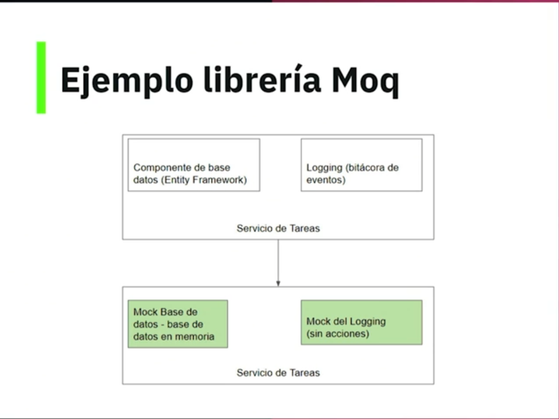

# Curso de Unit Testing con C# y .NET

Este curso está diseñado para proporcionarte una comprensión completa de las pruebas unitarias en el entorno de desarrollo de C# y .NET. A lo largo del curso, aprenderás los fundamentos de las pruebas unitarias, cómo escribir y ejecutar pruebas, y cómo utilizar frameworks de pruebas populares como NUnit y xUnit.

## Clase 1 - Conoce una prueba unitaria de concatenación de strings en C\#

Pruebas unitarias: pequeñas piezas de código que van a ayudar a probar la lógica de las aplicaciones.

El proyecto del curso se basa en una serie de operaciones para manipular diferentes Strings.

Para convertir una función en prueba lo que se tiene que hacer es agregar el atributo `[Fact]`.

## Clase 2 - Prerequisitos

- Conocimientos de C# y .NET
- POO en C#
- .NET 7 0 superior
- Visual Studio Code o Visual Studio

## Clase 3 - ¿Qué son pruebas unitarias?

**TDD**(Test-Driven Development): Metodología de trabajo o estilo de programación. Lo que dice TDD es se deben crear todas las pruebas al inicio del proyecto, esas prueba van a fallar ya que aún no existe la implementación del código.

Una vez implementado el código deben de pasar todas las pruebas, luego se debe de estar realizando un refactor constantemente, ya que se puede estar agregando lógica que antes no se habia contemplado o nuevos funcionamientos solicitados.

**Pruebas unitarias:**

- Pruebas sobre una unidad de código como una propiedad, función o método.
- Automatizables.
- Reutilizables.
- Independientes.

En resumen se puede decir que las pruebas unitarias son: **Piezas de código que pruebas otras piezas de código**

**Importancia:**

- Nos ayudan a verificar de manera rápida la lógica de negocio de nuestro código.
- Detectan cambios que afectan la funcionalidad de manera rápida.
- Se implementan del lado de desarrollo.
- Son fáciles de implementar.

Enlace:

[Free Ebook - Unit Testing Succinctly](https://www.syncfusion.com/succinctly-free-ebooks/unittesting)

## Clase 4 - Librerías de pruebas en .NET

**MSTest**:

- Microsoft Test.
- Gran soporte por el equipo de Microsoft.
- Excelente integración con Visual Studio.
- Alta complejidad para algunos escenarios.

**NUnit**:

- JUnit para .NET.
- Opensource con gran soporte.
- Muy fácil de usar.

**xUnit**: (Librería a usar en el curso)

- Creada por la comunidad.
- Open source con gran soporte.
- Simplifica todo el proceso de creación de pruebas.
- Una de las más populares para nuevos y modernos proyectos con .NET.

Enlaces:

- [NUnit.org](https://nunit.org/)
- [Home > xUnit.net](https://xunit.net/)
- [Unit testing C# with MSTest and .NET - .NET | Microsoft Learn](https://learn.microsoft.com/en-us/dotnet/core/testing/unit-testing-with-mstest)


Solo se necesita el atributo `[Fact]` para que cualquier método se convierta en una prueba unitaria, se utiliza el `Assert.` que ayuda a verificar el resultado de la prueba y corressponda con lo que se necesita.

## Clase 5 - Herramientas y código base

Código base se encuentra en GitHub en la rama Master o rama 0-codigobase:

[GitHub - platzi/curso-unit-testing-csharp](https://github.com/platzi/curso-unit-testing-csharp)

El proyecto representa lo que sería una librería en un proyecto real que tiene diferentes funciones para manipular cadena de caracteres.

## Clase 6 - Creando tu primera prueba con xUnit

A nivel de código con Visual Studio lo que se hace es crear un nuevo proyecto, la plantilla que se utilizará es de tipo prueba o test, la plantilla se llama `Proyecto de pruebas xUnit`.

Por buenas prácticas se utiliza el mismo nombre del proyecto que se va a probar y se incluye la palabra "Tests" al final, para este caso sería `StringManipulation.Tests`.

Dentro del nuevo proyecto se crea una nueva clase con el nombre `StringOperationsTest`, para este también se utiliza la convención de ponerle el mismo nombre de la case a la que se le van a realizar las pruebas incluyendo la palabra `Test` al final.

Para poder crear las pruebas es necesario agregar la referencia del proyecto que tiene la clase que se va a probar en este caso se debe ir al proyecto `StringManipulation.Tests` sobre la opción que dice `Dependencias` dar clic derecho `Agregar referencia del proyecto` y en la nueva ventaja que se abre seleccionar el proyecto principal `StringManipulation`.

La clases de pruebas siempre deben de ser publica para que se pueda acceder.

En la clase creado `StringOperationsTest.cs` se crea un método de prueba para uno de los método de la clase principal, al método se le incluye el atributo `[Fact]`.

Para la ejecución de las pruebas se realizar desde el "Explorador de pruebas" de  Visual Studio.

## Clase 7 - Tipos de Assert en xUnit

Buenas prácticas en testing:

**Estructura AAA:**

_**A**rrange_: Donde configuramos las variables, datos de prueba o el objeto que tiene la función que deseamos comprobar
_**A**ct_: La ejecución de la funcionalidad que deseamos comprobar.
_**A**ssert_: La comprobación del resultado.

**F.I.R.S.T principles of testing**:

- **F**ast
- **I**solated/Independent
- **R**epeatable
- **S**elf-validating
- **T**horough

A nivel de código se implementan otras comprobaciones de xUnit que se utilizan con el `Assert` en la primera prueba, que ayudan a validar que el resultado no sea nulo y tampoco que este vacío.

Por temas de buenas practicas se debe de validar los múltiples escenarios que se puedan presentar en las pruebas, una buena práctica es al nombre del método incluir el tipo de escenario que se está probando, por ejemplo: Si un método retorna True o False tener un método para validar cuando retorne True y cuando retorne False.

Desde la consola con el comando también se pueden ejecutar las pruebas:

```Bash
dotnet test
```

**Información Complementaria**:
Los “First Principles of Testing” (Primeros Principios de Pruebas) son una serie de conceptos fundamentales que sirven como base para la disciplina de la ingeniería de pruebas de software. Estos principios se utilizan para guiar la planificación, diseño y ejecución de pruebas de software de manera efectiva y eficiente. A continuación, se describen algunos de los principales primeros principios de pruebas:

El propósito de las pruebas es demostrar la presencia de defectos: El objetivo principal de las pruebas de software es encontrar defectos o errores en el software. Las pruebas no pueden demostrar que un software es completamente libre de errores, pero pueden proporcionar evidencia de la presencia de defectos.

La exhaustividad de las pruebas es imposible: No es posible probar todas las combinaciones posibles de entradas y condiciones en un programa. Por lo tanto, las pruebas se centran en áreas críticas y se basan en la priorización de riesgos para determinar qué probar.

Pruebas tempranas: Las pruebas deben comenzar tan pronto como sea posible en el ciclo de vida del desarrollo de software. Esto permite identificar y abordar problemas en etapas tempranas, lo que suele ser más económico y eficiente que corregir defectos más tarde.

Separación de responsabilidades: El equipo de pruebas debe ser independiente del equipo de desarrollo. Esto ayuda a garantizar una evaluación imparcial y objetiva del software.

Pruebas exhaustivas no garantizan la calidad: Incluso si se realizan pruebas exhaustivas, no se puede garantizar que el software sea completamente libre de defectos. Las pruebas son una parte importante, pero no la única, de un proceso de aseguramiento de la calidad más amplio.

Pruebas de acuerdo con especificaciones: Las pruebas deben basarse en las especificaciones del software, que incluyen requisitos funcionales y no funcionales. Las pruebas exitosas son aquellas que demuestran que el software cumple con estas especificaciones.

Pruebas de regresión: Después de realizar cambios en el software, es importante volver a ejecutar las pruebas existentes para asegurarse de que los cambios no introduzcan nuevos defectos o afecten negativamente a la funcionalidad existente.

Automatización de pruebas: La automatización de pruebas puede mejorar la eficiencia de las pruebas, especialmente en casos de pruebas repetitivas o de regresión. Sin embargo, no todas las pruebas son adecuadas para la automatización.

Estos principios proporcionan una base sólida para el desarrollo de estrategias de pruebas efectivas y ayudan a los equipos de desarrollo de software a garantizar la calidad y confiabilidad de sus productos.

## Clase 8 - Tipos de Assert en xUnit parte 2

En las validaciones se puede utilizar `StartWith` para valida que el resultado comience con cierto caracteres y `Contains` paara verificar que si contenga la palabra relacionada.

```C#
//Assert
Assert.StartsWith("diez", result);
Assert.Contains("cat", result);
```

Cuando se tienen métodos que retornan un `throw new ArgumentNullException();` también se requiere una prueba que haga dicha validación.

## Clase 9 - Atributos Theory e InlineData

Con los atributos que ofrece xUnit se puede uitilizar párametros en el método de prueba, en vez de utilizar el atributo `[Fact]` se utiliza el atributo `[Theory]`, con esto se puede pasar el atributo `[InlineData]` que va a contener los valores que recibiran los párametros que nos permitirá reutilizar la prueba para poder realizar diferentes comprobaciones dentro de la misma estructura del código de prueba.

## Clase 10 - Atributo Skip

El atributo `Skip` en XUnit es una forma de omitir temporalmente una prueba unitaria. Puedes utilizar este atributo para evitar que una prueba se ejecute sin tener que eliminarla del código .

Para utilizar el atributo Skip, simplemente coloca `[Fact(Skip = "Razón para omitir la prueba")]` encima de la definición de la prueba.

Enlace:

[Comparing xUnit.net to other frameworks](https://xunit.net/docs/comparisons)

## Clase 11 - Revisemos lo que hemos aprendido

Las pruebas unitarias son la base que permite que se pueda aplicar TDD de una manera correcta, complementando las diferentes comprobaciones de la lógica del código antes de realizar la implementación y luego poder ejecutar las pruebas constantemente mientras se realiza la implementación del código hasta que las pruebas pasen.

Normalmente las pruebas unitarias se hacen despues de realizar la implementación del código.

**Librerías de pruebas:** - MSTest, - MUnit - xUnit

**Nombramientos de pruebas:**

- MyProject -> MyProject.Test
- MyClass -> MyClassTest

**Estructura AAA**:

- Arrange
- Act
- Assert

## Clase 12 - Concepto de mock y librería moq en .NET

El concepto de moq nos ayuda a porder simular dependencia que tengamos en nuestro código y de esta manera hacer que nuestras pruebas se ejecuten de manera independiente.

Mock se refiere a un elemento que es imitado o simulado, la idea es evitar la dependencia directa que se puede tener en nuestro código hacía ese elemento como tal (puede ser: servicio, clase, interfaz, clase abstracta, etc).

Por ejemplo se pueden tener dependencia sobre servicios de AWS, Azure, dependencias sobre código externo a nuestro proyecto, entonces lo que se desea realizar es simular el comportamiento de esos servicios o componentes y poder comprobar la lógica del proyecto.


Las dependencias puede ser cualquier servicio externo, entonces lo que se hace es convertir esas dependencias en MOCKS.

El objetivo de una prueba unitaria es que no dependa de las bases de datos, la idea es que los MOCKS simulen el valor que devolvería devolver la base de datos y luego realizar la prueba con ese valor de esta mamera no se depende de una base de datos.



## 